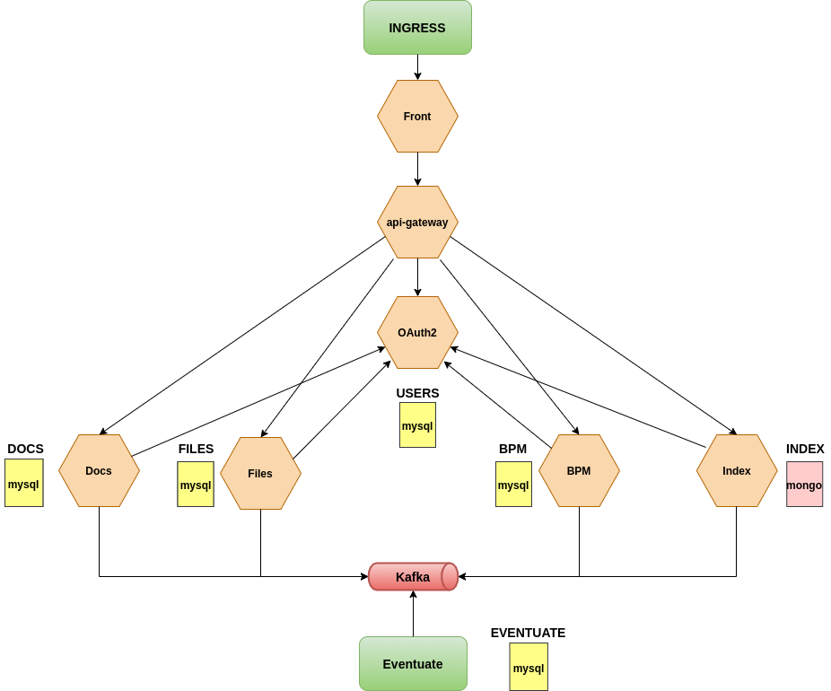

# TFM 2021/2022 Filesmanagement (Gestor de Expedientes)

<h1> Introducción </h1>

<p>La aplicación desarrollada corresponde con un gestor de expedientes que dispone de <b>documentación asociada</b> a estos y que está sujeta a un flujo de tramitación <b>(BPM)</b>. Este flujo de tramitación es una herramienta horizontal a una organización en la que pueden integrarse distintas aplicaciones, que pueden tramitar, en un determinado momento, el flujo correspondiente, de esta manera se puede orquestar un proceso completo en la gestión de un expediente en la que pueden verse involucrados varias aplicaciones o servicios. </p>

<h1> Arquitectura </h1>
La aplicación descrita con anterioridad ha sido implementada usando una arquitectura basada en microservicios y un diseño basado en eventos. Son 7 los microservicios desarrollados para la aplicación Filemanagement, representados con un hexágono en el siguiente diagrama:



La interacción y dependencias entre estos microservicios y los servicios correspondientes, están detallados en el documento de <b>"Memoria académica"</b> de este TFM.

<h1> Compilación y generación de artefactos</h1>

Todos y cada uno de los 7 microservicios tienen su propio repositorio de git, por tanto es necesario realizar clonado de cada repositorio en local: 

`git clone <URL del repositorio>`

<h2>Maven</h2>
En el desarrollo de estos microservicios se ha utilizado la <a href="https://maven.apache.org/">Maven 3.8.4</a> como herramienta para la generación de artefactos. Es importante destacar que existen microservicios que tienen alguna dependencia con algún componente común o API de otro microservicio. Estas dependencias y sus correspondientes versiones se ubican en un repositorio Maven implementado por <a href="https://jfrog.com/artifactory">Artifactory</a> que forma parte del entorno de integración continua que se explicará con posterioridad, pero que es necesario tener en mente para la configuración del archivo <b>settings.xml</b> correspondiente:

```
<?xml version="1.0" encoding="UTF-8"?>
<settings xsi:schemaLocation="http://maven.apache.org/SETTINGS/1.1.0 http://maven.apache.org/xsd/settings-1.1.0.xsd"
	xmlns="http://maven.apache.org/SETTINGS/1.1.0"
	xmlns:xsi="http://www.w3.org/2001/XMLSchema-instance">
	<servers>
		<server>
			<id>filesmanagements-repository</id>
			<username>file-user-repo</username>
			<password>?????????????</password>
			<passphrase>?????????????</passphrase>
		</server>
	</servers>
	<profiles>
		<profile>
			<id>default</id>
			<repositories>
				<repository>
					<id>filesmanagements-repository</id>
					<name>Repositorio virtual filesmanagement</name>
					<url>http://artifactory:8101/artifactory/files-repository/</url>
					<releases>
						<enabled>true</enabled>
					</releases>
					<snapshots>
						<enabled>true</enabled>
					</snapshots>
				</repository>
			</repositories>
		</profile>
	</profiles>
	<activeProfiles>
		<activeProfile>default</activeProfile>
	</activeProfiles>
</settings>
```

Debido a que existe un proceso CD / CI que ejecutará una serie de 'stages' para garantizar la calidad del software desarrollado, debería ejecutarse el siguiente comando Maven:

`mvn clean verify pmd:check package`

El anterior comando ejecuta los plugins de <a href="https://pmd.github.io/">PMD</a> y <a href="https://checkstyle.org/">checkstyle</a> configurados en cada uno de los microservicios. Después de compilar el proyecto, éste puede ser levantado mediante el siguiente comando de Maven:

`mvn spring-boot:run`

También puede generarse en un entorno local, una imagen Docker correspondiente al microservicio correspondiente, mediante la ejecución del siguiente comando de Maven:

`mvn com.google.cloud.tools:jib-maven-plugin:3.2.0:build -Dimage=<NOMBRE_IMAGEN>:<VERSION> -Djib.to.auth.username=<USUARIO_DOCKER_HUB> -Djib.to.auth.password=<PASSWORD_DOCKER_HUB>`

<h2>Java</h2>
Todos los microservicios estan desarrollados con la <b>versión 17 de Java</b>.

<h2>Docker y docker-compose</h2>

Desde el punto de vista del desarrollo en un entorno local, es interesante utilizar Docker y/o Docker-compose, que permiten levantar servicios y microservicios, previamente dockerizados. En la carpeta "/docker" existen tres archivos de configuración de docker-compose que pueden ayudar al desarrollador en local:
-	docker-compose.yml: contiene todos los servicios y microservicios de la aplicación. Se tendrá que tener en cuenta las versiones actuales de cada uno de ellos para su integración.

-	docker-compose-services.yml: contiene solamente los servicios, por lo que se podría, por ejemplo, realizar pruebas de integración con una base de datos o una cola Kafka.

-	docker-compose-ci.yml: como ya se verá más adelante, este fichero levantan el entorno de integración.

Para poder utilizar alguna de estas configuraciones, es necesario ejecutar alguno de los siguientes comandos:

`docker-compose -f <FICHERO.yml> up` -> 
	Crea los contenedores y los inicializa.

`docker-compose -f <FICHERO.yml> down` -> 
	Elimina los contenedores previamente creados en el fichero.

`docker-compose -f <FICHERO.yml> start` -> 
	Inicializa los contenedores creados previamente por el mismo fichero.
	
`docker-compose -f <FICHERO.yml> stop` -> 
	Realiza la parada de los contenedores iniciados previamente por el mismo fichero.

<h2>Kubernetes</h2>
En la carpeta "/k8s" se encuentran los manifiestos necesarios para el despliegue de los microservicios y de los servicios en Kubernetes. Esta carpeta tiene la siguiente estructura:
<br/>

-	<b>ci-cd</b>: esta carpeta contiene el manifiesto para el despliegue de jenkins.
-	<b>svc</b>: contiene todos los manifiestos de los servicios (kafka, mongodb, mysql, zookeeper).
-	<b>bpm.yml</b>: manifiesto del microservicio de BPM.
-	<b>cdc-service.yml</b>: manifiesto del servicio de Eventuate.
-	<b>docs.yml</b>: manifiesto del microservicio de DOCS (documentación).
-	<b>files.yml</b>: manifiesto del microservicio de FILES (expedientes, principal).
-	<b>front.yml</b>: manifiesto del microservicio para el fontal de la aplicación.
-	<b>gateway.yml</b>: manifiesto del microservicio de Gateway.
-	<b>index.yml</b>: manifiesto del microservicio de indexación.
-	<b>ingress.yml</b>: manifiesto para la configuración de Ingress.
-	<b>oauth2.yml</b>: manifiesto del microservicio de autenticación.
-	<b>secrets.yml</b>: manifiesto de configuración usuarios y passwords.

<h1>Okteto</h1>
<a href="https://www.okteto.com/">Okteto</a> es un proyecto de código abierto que ofrece una distribución de Kubernetes en cloud. Para poder desplegar manifiestos en Kubernetes, es necesario autenticarse con una cuenta de github y configurar el entorno local para que la herramienta kubectl apunte a Okteto. En la siguiente URL puede obtenerse ayuda acerca de este proceso: <a href="https://www.okteto.com/docs/getting-started/">getting-started</a>

<h2>kubectl</h2>
Esta herramienta es un cliente para cualquier distribución de Kubernetes y por tanto se hace necesaria su utilización. A través de de este cliente se pueden realizar operaciones CRUD de servicios, PODs, etc.

<h1>Integración y despliegue continuo (CD / CI)</h1>
El sistema de integración y despliegue continuo consta de dos herramientas que son desplegadas mediante manifiestos de Docker y docker-compose:

<h2>Artifactory</h2>
Artifactory es un repositorio privado de Maven que alberga los artefactos generados y que se encuentran versionados, ya sea, versiones releases como versiones snapshots. La generación de estos artefactos tiene lugar en los jobs ejecutados por Jenkins y su versión viene determinada por la rama de git asociada.
La configuración de Docker utilizada para la generación de contenedor es:

`docker run --name artifactory -v <VOLUMEN>:/var/opt/jfrog/artifactory -d -p 8101:8081 -p 8102:8082 releases-docker.jfrog.io/jfrog/artifactory-oss:latest`

<h2>Jenkins</h2>
Es un servidor de automatización basado en jobs que ejecutan pipelines. Para generar el contenedor puede utilizarse el manifiesto de docker-compose ubicado en:

`/docker/docker-compose-ci.yml`. 

Todos los pipelines que son ejecutados mediante Jenkins son obtenidos del fichero <b>Jenkinsfile</b> existente en cada microservicio.
Una posible configuración de jobs es la utilizada en este TFM que tiene las siguientes configuraciones:

-	Crear proyecto "Multibranch": mediante este tipo de proyectos, Jenkins puede obtener todas las ramas de un repositorio.
-	Configurar el repositorio de git: previamente hay que generar las credenciales y guardarlas en Jenkins.
-	Asignar la ubicación relativa al proyecto donde se encuentra el fichero Jenkinsfile.
-	Configurar tiempo para el poll que conecta Jenkins con el repositorio
-	El despliegue de la aplicación en Okteto se realiza mediante la ejecución del contenedor de una imagen (dtzar/helm-kubectl). Para configurar las credenciales es necesario realizar un mapeo del fichero ".kube" que genera la instalción de la consola de Okteto 

Al finalizar la configuración, Jenkins detectará cualquier cambio en alguna de las ramas del repositorio y lanzará el siguiente flujo, común para todos los microservicios:


<h2>Documentos</h2>
En el siguiente link podrá descargar la presentación del TFM de este proyecto en dos formatos distintos: 

[Presentación PDF](./docs/Presentación-TFM-FIles_management_agat.pdf)

[Presentación PPT](./docs/Presentación-TFM-FIles_management_agat.pptx)
